# project_magicard

마법카드(마이 법인 카드) 프로젝트 레포지토리입니다

<!-- 배포주소: https://magicard.azurewebsites.net -->

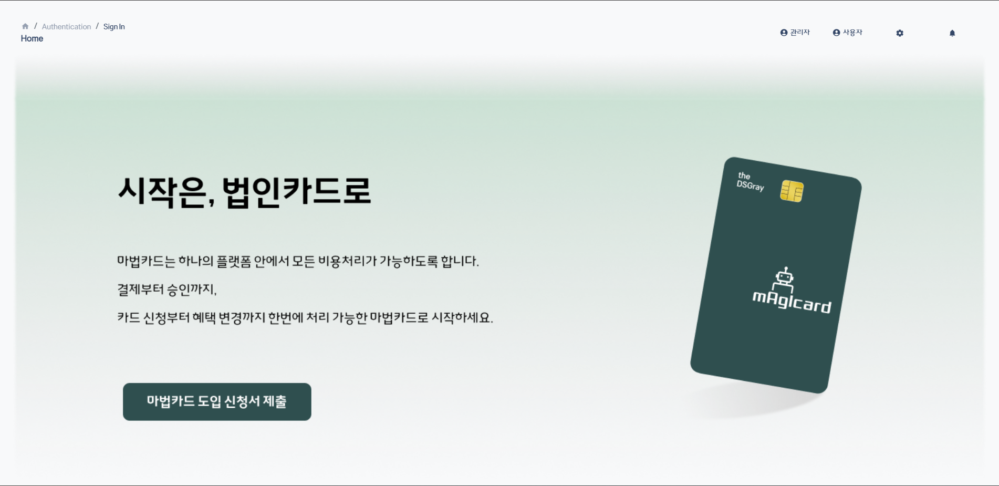

 
 

**팀원 소개**
|||||||
|:---:|:---:|:---:|:---:|:---:|:---:|
|**노승광**|**민성환**|**박정우**|**신서영**|**정문경**|**정주영**|

# 목차

- [project_magicard](#project_magicard)
- [목차](#목차)
- [개요](#개요)
- [기술 스택](#기술-스택)
- [프로젝트 설명](#프로젝트-설명)
- [DEMO](#demo)
- [구현 기능](#구현-기능)

# 개요

- 프로젝트 이름 : MagiCard
- 프로젝트 진행 기간 : 2024.01 - 2024.02

  

# 기술 스택

- Front-End : , 
- Back-End : , , 
- DataBase : 
- 배포 : 
    

# 프로젝트 설명

법인 카드 사용 승인 절차를 한 곳에서 간단하게!  
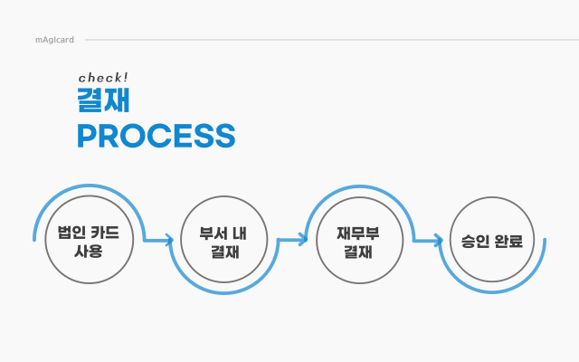
상급자는 일반 사원과 관리자의 중간다리 역할을 하게 된다.  
일반 사원은 부서 내의 상급자에게 승인을 요청하게 되고, 본인이 부서내 상급자라면 상위 부서의 상급자에게 승인 요청을 하게 된다.

# DEMO

|             **결제 내역**             |
| :-----------------------------------: |
| 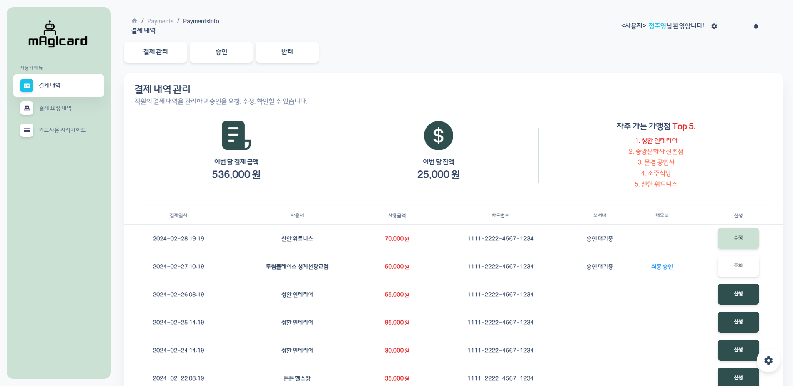 |

|          **결재 요청 내역**           |
| :-----------------------------------: |
| 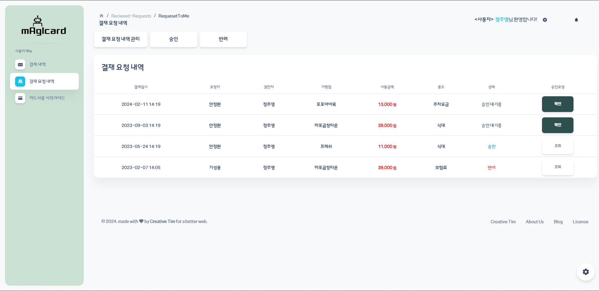 |

|       **카드 사용 시작가이드**        |
| :-----------------------------------: |
|  |

발급 받은 카드는 사용 등록을 마쳐야 카드를 사용할 수 있다!

|             **대시보드**              |
| :-----------------------------------: |
| 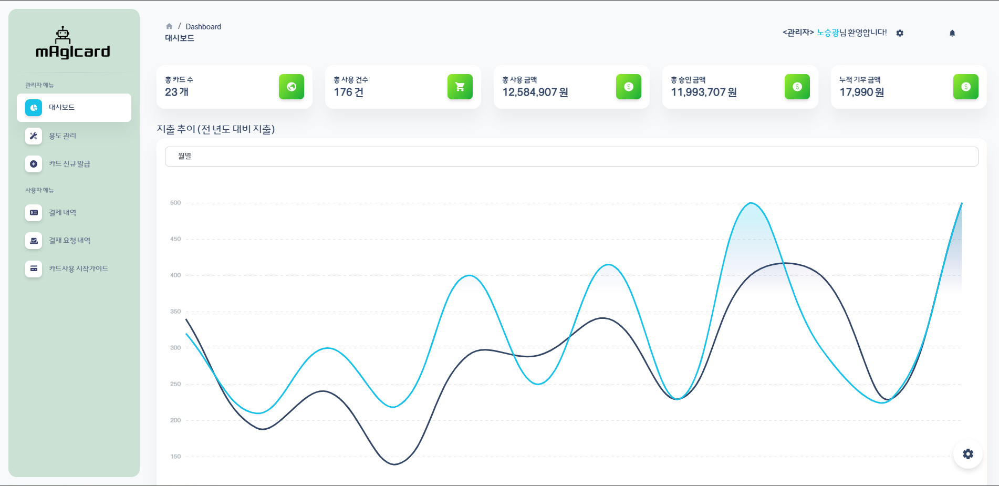 |

결제 내역과 결재 처리된 승인 건들의 통계를 볼 수 있다.

  

**용도 관리**
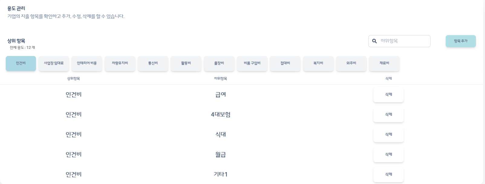
각 회사에 맞는 용도를 설정할 수 있어, 개정처리에 용이하다.
  

**카드 발급**
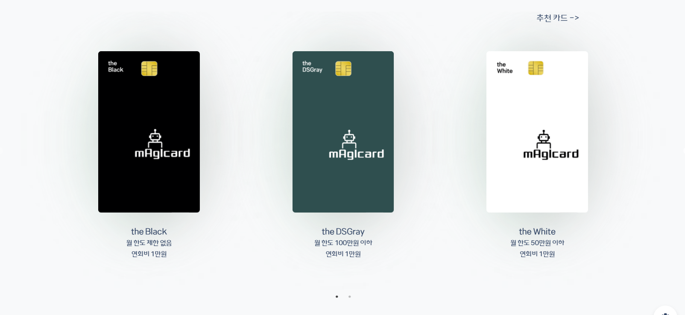
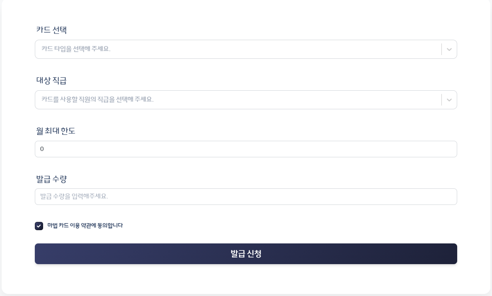
관리자는 새로 회사를 등록하거나, 신입사원이 들어왔을 때 알맞은 카드를 신청할 수 있게 된다.
  

| **승인 요청 과정**                                                       |
| ------------------------------------------------------------------------ | ---------------------------------------------------------------------------- |
| 기존의 불편함                                                            | AI로 개선                                                                    |
| 
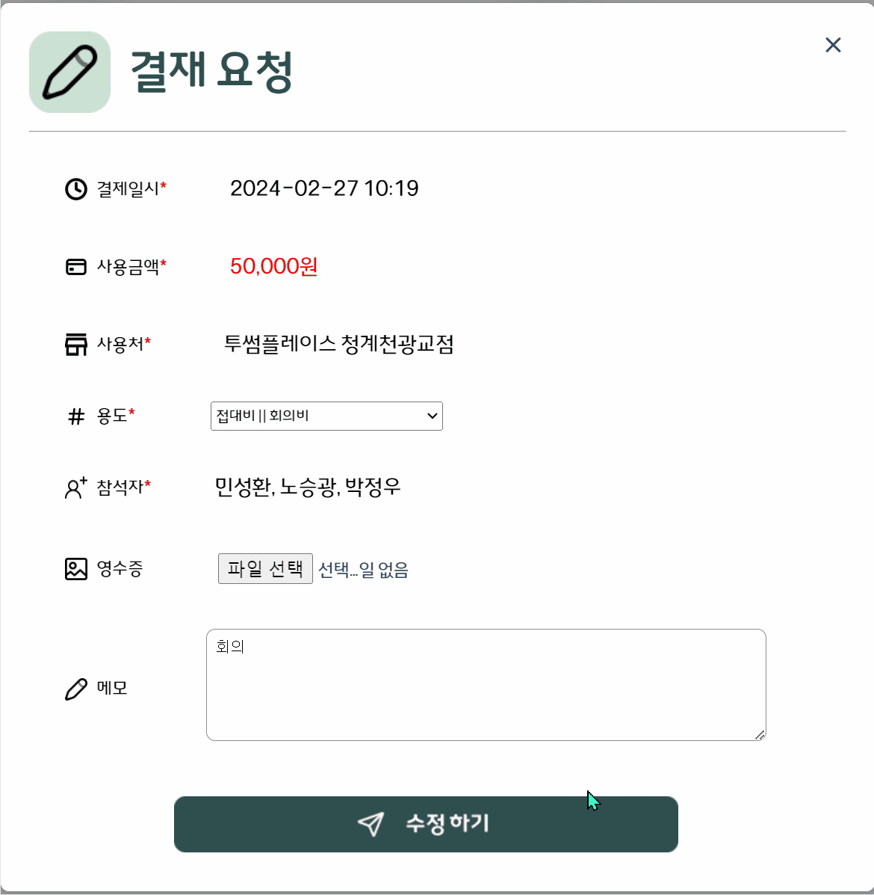
 | 
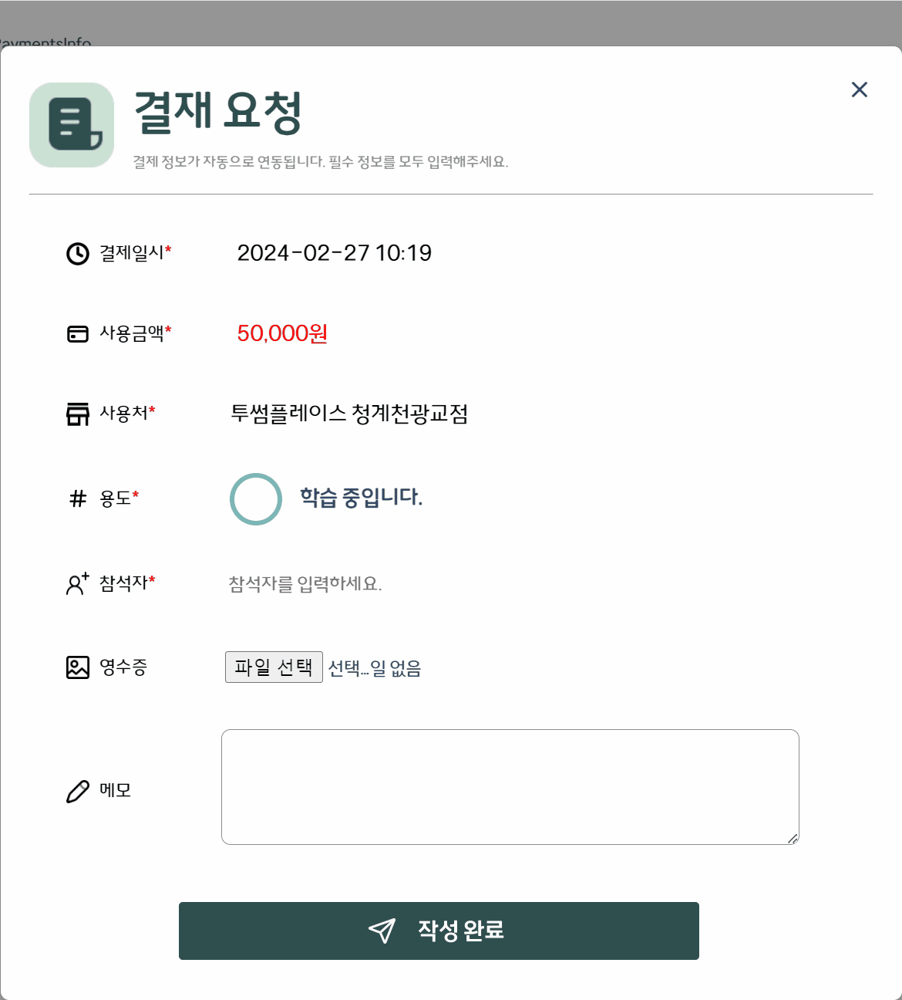
 |

매직 카드의 AI는

1. 결제 정보 파악
2. 결재 내역 학습
3. 회사 용도 반영

를 토대로 용도를 추천합니다.

ai가 사용처와 금액을 통해 자동으로 용도 매핑!

  

왼쪽고 같이 학습을 하면서 사용처에 맞는 용도를 추천해준다.  
알맞게 추천된 결과를 일반 사용자는 상급자에게, 상급자는 재무부에게 승인 요청을 하게 된다.
  

**승인, 반려**

  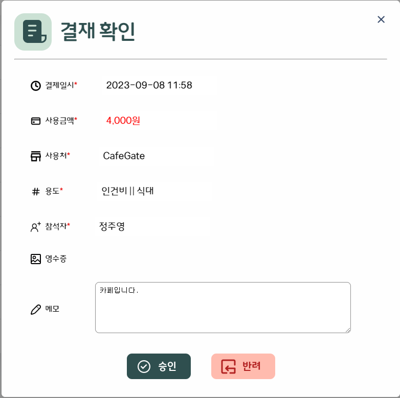
  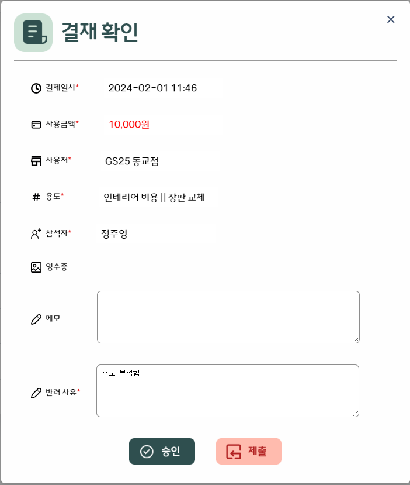

상급자, 관리자는 승인 요청을 받을 수도 있고, 반려를 할 수도 있게 된다.
  

**수정**

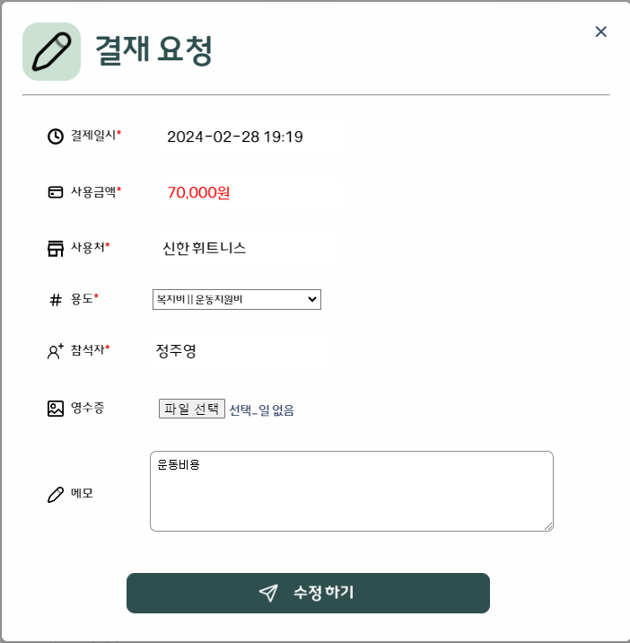

반려된 요청은 요청자가 수정하여 다시 요청할 수 있게 된다.  
단, 반려가 2번 이상인 요청건은 요청을 할 수 없다.
  

# 구현 기능

  

<!-- # 배운 점 & 아쉬운 점

- 노승광
  - 배운 점 :
  - 아쉬운 점 :
- 민성환
  - 배운 점 :
  - 아쉬운 점 :
- 박정우
  - 배운 점 :
  - 아쉬운 점 :
- 신서영
  - 배운 점 : spring boot & JPA를 배울 수 있었고,
  - 아쉬운 점 :
- 정문경
  - 배운 점 :
  - 아쉬운 점 :
- 정주영
  - 배운 점 :
  - 아쉬운 점 : -->
